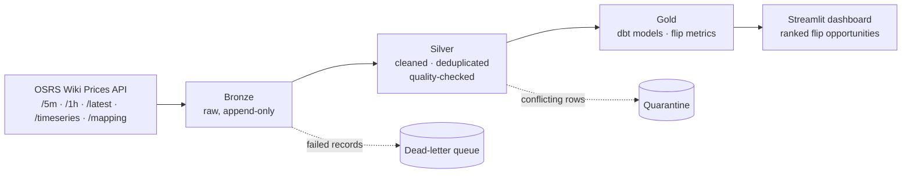

# OSRS Grand Exchange Data Pipeline

> A medallion-architecture data pipeline that ingests Old School RuneScape Grand Exchange
> market data and surfaces profitable flip opportunities — built with production-grade
> patterns: idempotent ingestion, data-quality quarantine, and orchestrated batch loads.
>
> **Status: In active development** — see Project Status below.

## Overview

The OSRS Grand Exchange is a live, player-driven market whose prices come from real
completed trades. This project polls that market on a schedule and lands it through a
Bronze → Silver → Gold medallion architecture, then surfaces **flip opportunities (profitable buy/sell spreads ranked by margin and volume) through an analytics dashboard.**
It treats a game economy as a real data source to exercise end-to-end data-engineering
patterns.

## Architecture



## Tech Stack

| Concern | Tooling |
|---|---|
| Compute / storage | Databricks serverless (Spark), Delta Lake |
| Transformation | dbt (dbt-databricks) |
| Orchestration | Apache Airflow (Dockerized) → Databricks Connect |
| Serving | Streamlit |
| Source | OSRS Wiki Real-time Prices API |
| Language | Python (PySpark), SQL |

## Key Design Decisions

- **Idempotent ingestion** — Bronze→Silver loads use Delta `MERGE` keyed on
  (item_id, window_timestamp) so re-runs never duplicate or corrupt state; the
  pipeline is safe to retry.
- **Dead-letter queue** — records failing schema/quality checks route to a DLQ table
  rather than silently dropping or failing the batch, keeping ingestion resilient and
  auditable.
- **Hybrid quarantine in Silver** — Bronze preserves conflicting rows as audit evidence;
  Silver refuses them into a quarantine table instead of hard-failing the load.
- **Flip-opportunity model** — the Gold layer computes profitable spreads from instabuy /
  instasell prices, ranked by margin and traded volume and capped by each item's Grand
  Exchange buy limit (from `/mapping`).
- **Orchestration via Databricks Connect** — Airflow (Docker) opens a remote Spark
  session on Databricks serverless and runs PySpark directly, avoiding notebook/wheel
  deployment overhead.
- **Descriptive User-Agent** — per the OSRS Wiki API acceptable-use policy, all requests
  send an identifying User-Agent (generic agents are blocked).
- **Grain & source** — Silver sourced from /5m, keyed on (item_id, window_timestamp); see docs/grain-decision.md

## Project Status

- [x] Architecture & data-flow design
- [x] Source API analysis + fact-table grain decision
- [ ] Bronze ingestion (raw, append-only)
- [ ] Silver (dedup, quality checks, DLQ + quarantine)
- [ ] Gold (dbt models + flip-opportunity metrics)
- [ ] Airflow DAG orchestration
- [ ] Streamlit dashboard (ranked flip recommendations + anomaly detection)

## Repository Structure

```
.
├── ingestion/   # Bronze API ingestion
├── dbt/         # Silver/Gold models + tests
├── airflow/     # DAGs + Dockerized Airflow
├── docs/        # design notes, grain decision
└── README.md
```

## Notes

Personal portfolio project built to practice production data-engineering patterns on a
real, free, high-volume data source. Actively in development.

## Future Scope

- **Phase 2 (deferred):** a retrieval-augmented (RAG) layer over the OSRS Wiki and Jagex
  patch notes to explain price spikes in natural language. Intentionally sequenced after
  the core pipeline is production-solid, so correctness of the data layer comes first.
