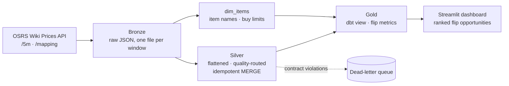

# OSRS Grand Exchange Data Pipeline

> A medallion-architecture data pipeline that ingests Old School RuneScape Grand Exchange
> market data and surfaces profitable flip opportunities — built with production-grade
> patterns: idempotent ingestion, data-quality routing, and orchestrated batch loads.
>
> **Status: In active development** — see Project Status below.

## Overview

The OSRS Grand Exchange is a live, player-driven market whose prices come from real
completed trades. This project polls that market on a schedule and lands it through a
Bronze → Silver → Gold medallion architecture, then surfaces **flip opportunities
(profitable buy/sell spreads ranked by margin, volume, and buy limit) through a Streamlit
dashboard.** It treats a game economy as a real data source to exercise end-to-end
data-engineering patterns.

## Architecture



Orchestrated by Airflow on a 5-minute schedule: a two-task ingestion DAG (fetch the window
for this interval → run the Silver transformation as a Databricks job), with dbt tests on a
separate daily schedule.

## Tech Stack

| Concern | Tooling |
|---|---|
| Compute / storage | Databricks (Spark), Delta Lake, Unity Catalog |
| Transformation | dbt Core (dbt-databricks) |
| Orchestration | Apache Airflow 3 (Dockerized) |
| Serving | Streamlit |
| Source | OSRS Wiki Real-time Prices API |
| Language | Python (PySpark), SQL |

## Key Design Decisions

- **Idempotent ingestion** — Bronze→Silver loads use Delta `MERGE` keyed on
  `(item_id, window_timestamp)`, using the *source's* window timestamp rather than the time
  the pipeline ran. A closed 5-minute window is frozen, so re-fetching always yields the same
  key and data — retries and late runs can never duplicate. Also makes the pipeline
  backfill-safe: windows can load in any order.
- **The window comes from the run's logical date, not the clock** — each DAG run derives its
  target window from the interval it represents and requests that window explicitly. A run
  that fires late, or is retried, or is backfilled months later still fetches the window it
  was always meant to. Fetching "whatever is current" would have made retries silently
  fetch the wrong data and made Airflow-native backfill impossible.
- **Grain & source selection** — Silver is sourced from `/5m` rather than `/latest`, because
  `/5m` provides a single grid-aligned window timestamp shared across the payload, while
  `/latest` returns per-item event times scattered off any regular interval. Choosing the
  endpoint was really a fact-table grain decision. See [docs/grain-decision.md](docs/grain-decision.md).
- **Schema-on-read forces a Map, not a struct** — `/5m` nests items as a JSON object keyed by
  item ID. Letting Spark infer the schema produces a ~4,000-column struct that can't be
  exploded; declaring `data` as a `MapType` makes the item IDs data rather than schema, so
  they explode cleanly into one row per item.
- **Three-way quality routing** — every Silver row lands in exactly one destination and
  nothing is silently dropped: contract violations (null/negative volume, missing item ID,
  non-positive price) route to a **dead-letter queue**; valid-but-empty rows are filtered;
  everything else continues. A *null price* is valid — it means no trade on that side that
  window — so it is never dead-lettered.
- **Sparse by design** — untraded items are absent from `/5m` entirely, so the fact table has
  rows only where trading occurred. Absence is the record of a non-event.
- **Star schema** — item names and buy limits come from `/mapping`, a separate source at a
  separate grain (one row per item, no time dimension). It's modelled as a Type 1 dimension
  (`dim_items`, full overwrite on refresh) and joined to the fact table at query time rather
  than denormalized into it.
- **Flip-opportunity model** — the Gold layer computes net margin from instabuy/instasell
  prices after the 2% Grand Exchange sell tax, surfaces both absolute and percentage return,
  and caps realistic profit by each item's buy limit.
- **Gold is a view, not a table** — `flip_opportunities` is materialized as a view, so it
  always reflects current Silver data without rebuilding a Gold table every time. This keeps
  the ingestion path off the SQL warehouse entirely: a warehouse queried every few minutes
  never reaches its idle timeout, so scheduling `dbt run` on the fast path would mean
  continuous warehouse uptime to transform a few thousand rows. At this data size a view
  performs identically to a table, so there's no meaningful tradeoff at this scale.
  `dbt run` executes only when model definitions change; tests run on their own daily schedule.
- **Realistic profit is capped by volume, not just the buy limit** — the dashboard ranks by
  margin multiplied by the *lesser* of the buy limit, the units available to buy, and the units
  someone will buy back. A 4-hour buy limit of 8,000 is meaningless on an item that trades six
  units in six hours, and ranking on the limit alone surfaced fantasy opportunities built on a
  single anomalous window.
- **Airflow orchestrates, Databricks executes** — ingestion runs as plain Python in Airflow
  (an HTTP request doesn't need a Spark cluster), while the Silver transformation is triggered
  as a Databricks job. Task ordering is load-bearing: Silver must not read before the new
  Bronze file lands, or it silently reprocesses stale windows.
- **Descriptive User-Agent** — per the OSRS Wiki API acceptable-use policy, all requests send
  an identifying User-Agent (generic agents are blocked).

## Project Status

- [x] Architecture & data-flow design
- [x] Source API analysis + fact-table grain decision
- [x] Bronze ingestion (raw, append-only, one file per window)
- [x] Silver (flatten, quality routing, DLQ, idempotent MERGE)
- [x] Item dimension (`dim_items` from `/mapping`)
- [x] Gold (dbt view + flip-opportunity metrics)
- [x] dbt tests (grain uniqueness + null constraints, on a daily schedule)
- [x] Automated Bronze landing to Databricks Volumes via the Databricks SDK
- [x] Airflow DAG orchestration (Dockerized)
- [x] Scheduled ingestion runs (every 5 minutes)
- [x] Streamlit dashboard (ranked flip recommendations)
- [ ] GitHub Actions CI/CD

## Repository Structure

```
.
├── bronze/      # API ingestion scripts (/5m windows, /mapping snapshot), bulk backfill
├── silver/      # Flatten + quality routing notebook, item dimension notebook
├── dbt/         # Gold layer — dbt models and tests
├── airflow/     # DAGs + Dockerized Airflow (docker-compose)
├── dashboard/   # Streamlit app
├── docs/        # Design notes, grain decision
└── README.md
```

## Known Gaps

Data and modelling limitations I'm aware of and have chosen not to solve:

- **Type corruption is indistinguishable from valid nulls.** A malformed price coerces to
  null on schema-on-read, which is the same signal as "no trade this side." Catching it would
  require validating raw payload types at Bronze.
- **Null buy limits.** `/mapping` returns null limits for some items; this appears to mean
  undocumented rather than unlimited, so it is left null and propagates as null downstream
  rather than being substituted.
- **Aggregated columns don't reconcile by hand.** In the dashboard, average prices are computed
  across all windows while average margin is computed only across windows where both sides
  traded. For an item with few complete windows, buy price minus sell price won't equal the
  reported margin. This is deliberate — a margin should only be measured where both prices
  existed at the same time — but it's surprising if you check the arithmetic.

## Hardening Backlog

Deliberate shortcuts taken to reach a working end-to-end pipeline, to be replaced:

- **Container dependencies install at startup** via `_PIP_ADDITIONAL_REQUIREMENTS`, which the
  Airflow compose file flags as quick-check-only. It reinstalls on every container start and
  pins no versions — drift between local and container has already caused one bug. Replacing
  it with a Dockerfile extending the Airflow image, with pinned versions, is the fix.
- **Connection config is spread across local env files and an Airflow Connection.**
  Consolidating on Airflow Connections as the single in-container source would remove the
  duplication; a secrets backend would be the production answer.

## Future Scope

- **Forward-filling missing prices** was considered and deliberately skipped: nulls cluster on
  illiquid items whose last trade may be hours old, so carried-forward values would be least
  reliable exactly where they'd be used.
- **Phase 2 (deferred):** a retrieval-augmented (RAG) layer over the OSRS Wiki and Jagex patch
  notes to explain price spikes in natural language. Sequenced after the core pipeline is
  solid, so correctness of the data layer comes first.

## Notes

Personal portfolio project built to practice production data-engineering patterns on a real,
free, high-volume data source. Actively in development.